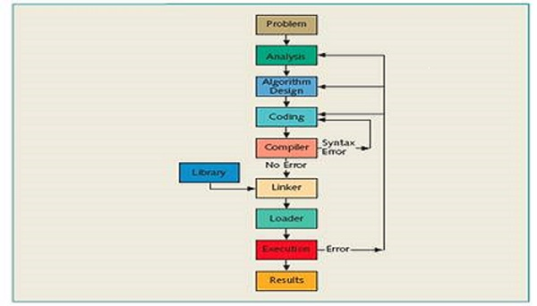

> Coding interview questions with solutions from top IT companies and hot startups

## <a name='toc'>Table of Contents</a>

- [ ] [Statement](#stat)
- [ ] [Problem](#prob)
  - [ ] [Array](#array)
  - [ ] [String](#str)
  - [ ] [Linked List](#list)
  - [ ] [Heap](#heap)
  - [ ] [Tree](#tree)
  - [ ] [Math](#math)
  - [ ] [Bit Manipulation](#bit)
  - [ ] [Graph](#graph)
  - [ ] [Sortiing and Search](#sortsearch)
  - [ ] [Dynamic Programming](#dp)
  - [ ] [Other](#other)
- [ ] [Special Topics](#st)

---

###[[⬆]](#toc) <a name='stat'>Statement:</a>

Most problems come from IT company interview. Some solutions are NOT my
original work, but I don't know who wrote them. Some problems are
difficult, and the special topics include some advanced ones.  

Most code style follows [Google C++ Style Guide](http://google-styleguide.googlecode.com/svn/trunk/cppguide.xml).

Total Number (not including the problem in the special topics) of Problems: about 201 (142 done).

Although I try to execute every program, bugs may still exist because I didn't run enough tests, welcome to find bugs. 
The solution may not be optimal, welcome to give your better solution. You can send the corresponding pull request. 

By default, the time complexity is the worst time and the space complexity doesn't include the stack space. 

---

###[[⬆]](#toc) <a name='prob'>Problem:</a>

####[[⬆]](#toc) <a name='array'>Array:</a>

* [Build b[i] = a[0]a[1]…a[n-1]/a[i]](https://github.com/checkcheckzz/coding-problem/blob/master/problem/Array/Build%20b%5Bi%5D.cpp)
* [Calculate the rotation distance for a sorted rotated array](https://github.com/checkcheckzz/coding-problems/blob/master/problem/Array/Rotatearraydistance.cpp)
* Celebrity problem
* [Detect cycle in an array](https://github.com/checkcheckzz/coding-problems/blob/master/problem/Array/Detect%20cycle%20in%20an%20array.cpp)
* [Detect the longest cycle in an array](https://github.com/checkcheckzz/coding-problems/blob/master/problem/Array/Detect%20the%20longest%20cycle%20in%20an%20array.cpp)
* [Diagonal elements sum of spiral matrix](https://github.com/checkcheckzz/coding-problems/blob/master/problem/Array/Diagonal%20elements%20sum%20of%20spiral%20matrix.cpp)
* [Find a partition in an array to minimize the sum of two parts](https://github.com/checkcheckzz/coding-problems/blob/master/problem/Array/Partitionnarray.cpp)
* Find a rectangle with four corners  1
* [Find elements in first array but not in second array](https://github.com/checkcheckzz/coding-problems/blob/master/problem/Array/Find%20none%20duplicate%20elements%20in%20two%20arrays.cpp)
* Find independent parts in an array
* [Find the ID with most posts](https://github.com/checkcheckzz/coding-problems/blob/master/problem/MostPosts.cpp)
* [Find the largest sum of 3 integers in a row in an array](https://github.com/checkcheckzz/coding-problems/blob/master/problem/Array/Find%20the%20largest%20sum.cpp)
* Find the longest consecutive increasing subarray in a grid
* [Find the maximal item A[i], such that A[i]=A[x]+A[y] in an array](https://github.com/checkcheckzz/coding-problems/blob/master/problem/Array/Find%20the%20max%20item%20A%5Bi%5D,%20such%20that%20A%5Bi%5D=A%5Bx%5D+A%5By%5D.cpp)
* [Find the minimal difference between two sorted arrays](https://github.com/checkcheckzz/coding-problems/blob/master/problem/Array/Find%20the%20minimal%20difference%20between%20two%20sorted%20arrays.cpp)
* Form an ascending sequence by removing elements
* [Given an array and a number k, if there exists an element arr[i] such that its duplicates lies in arr[i-k] and arr[i+k], return true, else return false](https://github.com/checkcheckzz/coding-problems/blob/master/problem/Array/Given%20an%20array%20and%20a%20number%20k.cpp)
* [Given an array of size n, the array contains numbers in range from 0 to k-1 where k is a positive integer and k <= n. Find the maximum repeating number in this array](https://github.com/checkcheckzz/coding-problems/blob/master/problem/Array/Find%20the%20maximum%20repeating%20number%20in%20this%20array.cpp)
* Given an integer array and a range, find all subarray such that its sum is in the range
* [Given an integer sequence, generate all sequences such that s1 < s2 >s3 < s4 >s5 <s6 ...](https://github.com/checkcheckzz/coding-problems/blob/master/problem/Array/Generate%20all%20sequences%20such%20that.cpp)
* [Given an unsigned int array with size n, the sum of array equals a, calculate a number k such that the sum of array becomes b when all numbers in the array greater than k is replaced by k](https://github.com/checkcheckzz/coding-problems/blob/master/problem/Array/Replaced%20by%20k.cpp)
* Given m sets, generate a new array arr (size m), where a[i] comes from set i, output all possible array arr
* [Given three arrays, select each number a, b, c from each array to minimize max(a-b,b-c,c-a)](https://github.com/checkcheckzz/coding-problems/blob/master/problem/Array/Minimize%20max(a-b,b-c,c-a).cpp)
* [Given two binary arrays A and B, i.e., containing only 0s and 1s each of size N. Find indices i,j such that Sum of elements from i to j in both arrays is equal and j-i (i.e. the length of the set i,j) is the maximum possible value](https://github.com/checkcheckzz/coding-problems/blob/master/problem/Array/Longest%20subarray%20with%20equal%20sum.cpp)
* [Length of first subarray that sums to zero](https://github.com/checkcheckzz/coding-problems/blob/master/problem/Array/Length%20of%20First%20continuous%20subarray%20that%20sums%20to%200.cpp)
* [Length of shortest subarray with sum larger than S](https://github.com/checkcheckzz/coding-problems/blob/master/problem/Length%20of%20shortest%20subarray%20with%20sum%20larger%20than%20S.cpp)
* Matrix Region Sum
* [Nearest greatest element](https://github.com/checkcheckzz/coding-problems/blob/master/problem/Array/Neargreatestelement.cpp)
* [Print all K-complementary in an array](https://github.com/checkcheckzz/coding-problems/blob/master/problem/Array/K-complementary.cpp)
* Recover the queue
* [Running average in a sliding window](https://github.com/checkcheckzz/coding-problems/blob/master/problem/Array/Running%20average%20in%20a%20sliding%20window.cpp)
* [Stable 2 way partition](https://github.com/checkcheckzz/coding-problems/blob/master/problem/Array/Stable%202%20way%20partition.cpp)
* Water flow path

--
####[[⬆]](#toc) <a name='str'>String:</a>

* [BinaryMatching](https://github.com/checkcheckzz/coding-problems/blob/master/problem/String/BinaryMatching.cpp)
* [Check whether two strings match by insertdeletereplace one char of any one of string](https://github.com/checkcheckzz/coding-problems/blob/master/problem/String/Edit%20Distance%20one.cpp)
* [Delete repeating strings](https://github.com/checkcheckzz/coding-problems/blob/master/problem/String/Delete%20repeating%20strings.cpp)
* [Find a vowel product sum of an ASCII string](https://github.com/checkcheckzz/coding-problems/blob/master/problem/String/Vowel%20product.cpp)
* [Find the first anagram of a given string in another string](https://github.com/checkcheckzz/coding-problems/blob/master/problem/String/Firstanagram.cpp)
* [Find the replace rule](https://github.com/checkcheckzz/coding-problems/blob/master/problem/String/Find%20the%20replace%20rule.cpp)
* [Generate all possible interleaves of two input strings](https://github.com/checkcheckzz/coding-problem/blob/master/problem/String/Allinterleaves.cpp)
* [Generate parentheses with different types](https://github.com/checkcheckzz/coding-problems/blob/master/problem/String/GenerateParentheseswithdiffkinds.cpp)
* Given a dictionary and a word, find all words with edit distance<=1 in this dictionary
* [Given a string, delete all char A，and double all char B](https://github.com/checkcheckzz/coding-problem/blob/master/problem/String/DeleteAdoubleB.cpp)
* [Given a string, print out the chars with maximal number of consecutive counts](https://github.com/checkcheckzz/coding-problems/blob/master/problem/String/Chars%20with%20maximal%20number%20of%20consecutive%20counts.cpp)
* [Given a string s and a dictionary, find the word break way with minimal number of words](https://github.com/checkcheckzz/coding-problem/blob/master/problem/String/Minimalwordbreak.cpp)
* [Given a string s, check whether it is k duplicates of a string t](https://github.com/checkcheckzz/coding-problem/blob/master/problem/String/Kduplicates.cpp)
* [Given k numbers, get a target with certain operators](https://github.com/checkcheckzz/coding-problems/blob/master/problem/String/Getanumber.cpp)
* [Given two string arrays, sort the string in first array according to the string order in second array](https://github.com/checkcheckzz/coding-problem/blob/master/problem/String/Sortfirstaccordingsecond.cpp)
* Implement regular expression
* Implement string.split()
* [Isomorphic Strings](https://github.com/checkcheckzz/coding-problem/blob/master/problem/String/Mapstring.cpp)
* [Longest substring containing just two unique chars](https://github.com/checkcheckzz/coding-problem/blob/master/problem/String/LongestSubstring2uniquechars.cpp)
* [Longest substring which appears more than once](https://github.com/checkcheckzz/coding-problems/blob/master/problem/String/Longest%20substring%20which%20appears%20more%20than%20once.cpp)
* [Longest substring which begins and ends with two unique chars](https://github.com/checkcheckzz/coding-problem/blob/master/problem/String/LongestSubstringbeginend2uniquechars.cpp)
* [Name numbers](https://github.com/checkcheckzz/coding-problems/blob/master/problem/Namenumbers.cpp)
* [One-byte or two-byte encoding](https://github.com/checkcheckzz/coding-problem/blob/master/problem/String/Onetwobyteencoding.cpp)
* [Ordered minimum window substring](https://github.com/checkcheckzz/coding-problem/blob/master/problem/String/Orderedminimumwindowsubstring.cpp)
* Pair with largest common words
* Permutation array of strings
* [Remove comments](https://github.com/checkcheckzz/coding-problems/blob/master/problem/String/Remove%20comments.cpp)
* Reverse index search
* String encode and decode
* [String of digits, insert addition operator in between to make sum to be a value](https://github.com/checkcheckzz/coding-problems/blob/master/problem/String/Makesum.cpp)
* [Two Words](https://github.com/checkcheckzz/coding-problems/blob/master/problem/String/Twowords.cpp)
* Valid Phone Number

--
####[[⬆]](#toc) <a name='list'>Linked List:</a>

* Flatten a list
* [Given linked list as a-x-b-y-c-z, output it as a-b-c-z-y-x](https://github.com/checkcheckzz/coding-problems/blob/master/problem/LinkedList/Reversealternatelist.cpp)
* [Insert into a Cyclic Sorted List](https://github.com/checkcheckzz/coding-problems/blob/master/problem/LinkedList/Insert%20into%20a%20Cyclic%20Sorted%20List.cpp)
* [List Level Sum](https://github.com/checkcheckzz/coding-problems/blob/master/problem/LinkedList/List%20level%20sum.cpp)

--
####[[⬆]](#toc) <a name='heap'>Heap:</a>

* [Kth maximal element of array c, where c[k]=a[i]+b[j], a, b are another two arrays](https://github.com/checkcheckzz/coding-problems/blob/master/problem/Heap/Kth%20maximal%20element%20of%20sum%20of%20two%20arrays.cpp)
* [Sliding Window Maximum](https://github.com/checkcheckzz/coding-problems/blob/master/problem/Heap/Sliding%20Window%20Maximum.cpp)
* [Two dimensional top k](https://github.com/checkcheckzz/coding-problems/blob/master/problem/Heap/TwoDtopk.cpp)
* [Water in two dimensional histogram](https://github.com/checkcheckzz/coding-problems/blob/master/problem/Heap/Waterin2dhistogram.cpp)

--
####[[⬆]](#toc) <a name='tree'>Tree:</a>

* Binary search tree Iterator
* [Binary tree Iterator](https://github.com/checkcheckzz/coding-problems/blob/master/problem/Tree/Iterator%20for%20binary%20tree.cpp)
* Check whether a tree exists
* Construct a tree by a list of pairs
* Construct a xml tree
* [Find the largest BST subtree in Binary Tree](https://github.com/checkcheckzz/coding-problems/blob/master/problem/Tree/Find%20the%20largest%20BST%20sub%20tree%20in%20BT.cpp)
* [Find the right most node in each level of binary tree](https://github.com/checkcheckzz/coding-problems/blob/master/problem/Tree/Find%20the%20right%20most%20node%20in%20each%20level%20of%20a%20binary%20tree.cpp)
* Flip a binary tree
* [Generate all binary trees according to preorder traversal](https://github.com/checkcheckzz/coding-problems/blob/master/problem/Tree/Generatebts.cpp)
* [Heapify a binary tree](https://github.com/checkcheckzz/coding-problems/blob/master/problem/Tree/Heapify%20a%20binary%20tree.cpp)
* [Immediate right neighbor of given node (parent links, no root) in binary tree](https://github.com/checkcheckzz/coding-problems/blob/master/problem/Tree/Immediate%20right%20neighbor.cpp)
* [Implement getNextNode()](https://github.com/checkcheckzz/coding-problems/blob/master/problem/Tree/Implement%20getNextNode().cpp)
* Large tree preorder travsersal
* [Longest distance between two nodes of binary tree](https://github.com/checkcheckzz/coding-problems/blob/master/problem/Tree/Longest%20distance%20between%20two%20nodes.cpp)
* [Maximal path sum of n-way tree](https://github.com/checkcheckzz/coding-problem/blob/master/problem/Tree/Maximalpathsum.cpp)
* [Morris traversal of Binary Tree](https://github.com/checkcheckzz/coding-problems/blob/master/problem/Tree/Moririsl%20traversal%20of%20Binary%20Tree.cpp)
* [PreInPostorder travel of binary tree with stack](https://github.com/checkcheckzz/coding-problems/blob/master/problem/Tree/PreInPostorder%20travel%20of%20bT%20with%20stack.cpp)
* [Printing all nodes at a given distance from a starting node in a binary tree](https://github.com/checkcheckzz/coding-problems/blob/master/problem/Tree/Printing%20all%20nodes.cpp)
* [Second largest node in BST](https://github.com/checkcheckzz/coding-problems/blob/master/problem/Tree/Second%20largest%20node%20in%20BST.cpp)
* SerializeDeSerialize a binary search tree
* [SerializeDeSerialize a binary tree](https://github.com/checkcheckzz/coding-problems/blob/master/problem/Tree/SerializeDeSerialize%20a%20binary%20tree.cpp)
* [SerializeDeSerialize an arbitrary nodes tree](https://github.com/checkcheckzz/coding-problems/blob/master/problem/Tree/SerializeDeSerialize%20an%20arbitrary%20nodes%20tree.cpp)
* [Shortest distance between two nodes of binary tree](https://github.com/checkcheckzz/coding-problems/blob/master/problem/Tree/Shortest%20distance%20between%20two%20nodes.cpp)
* Size of the largest complete subtree in a binary tree
* [Statistical binary search tree](https://github.com/checkcheckzz/coding-problems/blob/master/problem/Tree/Statistical%20binary%20search%20tree.cpp)
* [Switch binary tree to make equal](https://github.com/checkcheckzz/coding-problems/blob/master/problem/Tree/Switch%20binary%20tree%20to%20make%20equal.cpp)
* Trim binary search tree
* [Total weight of a subtree below this node](https://github.com/checkcheckzz/coding-problems/blob/master/problem/Tree/Totalweight.cpp)
* [Vertical sum in a binary tree](https://github.com/checkcheckzz/coding-problem/blob/master/problem/Tree/Vertical%20sum%20in%20a%20binary%20tree.cpp)

--
####[[⬆]](#toc) <a name='math'>Math:</a>

* [Angle between the hour and minute hands](https://github.com/checkcheckzz/coding-problems/blob/master/problem/Math/Angle%20between%20the%20hour%20and%20minute.cpp)
* [Calculate (m^n)%(10^k)](https://github.com/checkcheckzz/coding-problem/blob/master/problem/Math/Calculate%20(m%5En)%25(10%5Ek).cpp
* [Change a m base number to a n base number](https://github.com/checkcheckzz/coding-problems/blob/master/problem/Math/MbasetoNbase.cpp)
* [Delete k digits from a number to get minimal number](https://github.com/checkcheckzz/coding-problems/blob/master/problem/Math/Delete%20k%20digits.cpp)
* Divide a plane of points into two equal halves
* [Factorial digit sum](https://github.com/checkcheckzz/coding-problems/blob/master/problem/Math/Factorialdigitsum.cpp)
* [Find all numbers less than N, such that n = a^3 + b^3 = c^3 + d^3](https://github.com/checkcheckzz/coding-problems/blob/master/problem/Math/Specialnumber.cpp)
* [Find k from 1~n such that k=a^2 +b^2 (a, b positive integer)](https://github.com/checkcheckzz/coding-problems/blob/master/problem/Math/Number%20k%3Da%5E2%20%2Bb%5E2.cpp)
* Find largest triangle in convex hull aside from brute force search
* Find the complement domino pairs
* [Find the LCM and GCD of two numbers](https://github.com/checkcheckzz/coding-problems/blob/master/problem/Math/Find%20the%20LCM%20and%20GCD%20of%20two%20numbers.cpp)
* Find the longest 0s surrounded by 1s in a binary expression
* [Form a triangle](https://github.com/checkcheckzz/coding-problems/blob/master/problem/Math/Form%20a%20triangle.cpp)
* [For some N, print all the solutions of A*B = C*D where A, B, C, D are all 1~N](https://github.com/checkcheckzz/coding-problems/blob/master/problem/Math/Print%20all%20the%20solutions.cpp)
* [GetDecimal](https://github.com/checkcheckzz/coding-problems/blob/master/problem/Math/GetDecimal.cpp)
* [Get original number including digit 7](https://github.com/checkcheckzz/coding-problems/blob/master/problem/Math/Get%20original%20number%20including%20digit%207.cpp)
* [Given a list of integers of length n in the range of 1 to n-1, find the duplicate element (only one duplicate)](https://github.com/checkcheckzz/coding-problems/blob/master/problem/Math/Find%20the%20duplicate%20element.cpp)
* [Given a positive integer N, print all combinations of non-negative integer sum to N](https://github.com/checkcheckzz/coding-problems/blob/master/problem/Math/Print%20all%20combinations.cpp)
* [Happy Number](https://github.com/checkcheckzz/coding-problems/blob/master/problem/Happy%20Number.cpp)
* [Highest 1 position of binary expression](https://github.com/checkcheckzz/coding-problems/blob/master/problem/Math/Highest%201%20position%20of%20binary%20expression.cpp)
* [Impletement the cancall() function](https://github.com/checkcheckzz/coding-problems/blob/master/problem/Math/Cancallfunction.cpp)
* [Last digit of a^b](https://github.com/checkcheckzz/coding-problems/blob/master/problem/Math/Last%20digit%20of%20a%5Eb.cpp)
* Magic Number
* Nearest greater palindrome
* [Output true with probability 1/2^N given a function outputing true with probability 0.5](https://github.com/checkcheckzz/coding-problems/blob/master/problem/Math/Output%20true.cpp)
* [Print all numbers including digit 5 smaller than number N](https://github.com/checkcheckzz/coding-problems/blob/master/problem/Math/Printallnumwithdigit5.cpp)
* [Print prime factors of a given number](https://github.com/checkcheckzz/coding-problems/blob/master/problem/Primefactors.cpp)
* Random generator with blacklist
* [Read a line from a file randomly](https://github.com/checkcheckzz/coding-problems/blob/master/problem/Math/Readaline.cpp)
* [Return the duplicate indexs with equal probability](https://github.com/checkcheckzz/coding-problems/blob/master/problem/Math/Return%20the%20duplicate.cpp)
* [Sieve of Eratosthenes algorithm](https://github.com/checkcheckzz/coding-problems/blob/master/problem/SieveofEratosthenes.cpp)
* Smallest positive number that can not be represented

--
####[[⬆]](#toc) <a name='bit'>Bit Manipulation:</a>

* [Count the longest continuous 0 bits in an array](https://github.com/checkcheckzz/coding-problems/blob/master/problem/Bit/Count%20the%20longest%20continuous%20bit%200s.cpp)
* Flip bits

--
####[[⬆]](#toc) <a name='graph'>Graph:</a>

* [Black white reverse board game](https://github.com/checkcheckzz/coding-problems/blob/master/problem/Graph/Blackwhitereversegame.cpp)
* [Boggle puzzle](https://github.com/checkcheckzz/coding-problems/blob/master/problem/Graph/Bogglegame.cpp)
* Calculate the distance from each empty room to nearest guard
* Calculate the number of all 0s submatrix 
* [Catch that cow](https://github.com/checkcheckzz/coding-problems/blob/master/problem/Graph/Catchcow.cpp)
* [Graph Components](https://github.com/checkcheckzz/coding-problems/blob/master/problem/Graph/Graphcomponents.cpp)
* [How many carrots can the rabbit eat](https://github.com/checkcheckzz/coding-problems/blob/master/problem/Graph/How%20many%20carrots%20can%20the%20rabbit%20eat.cpp)
* Largest X structure in a grid
* [Number of closed rectangles in a matrix](https://github.com/checkcheckzz/coding-problems/blob/master/problem/Graph/Numberclosedrectangles.cpp)
* [Spreadsheet Calculation](https://github.com/checkcheckzz/coding-problems/blob/master/problem/Graph/Spreadsheet.cpp)
* [Total Shortest path](https://github.com/checkcheckzz/coding-problems/blob/master/problem/Graph/Totalshortestpath.cpp)
* [Traversal a Grid](https://github.com/checkcheckzz/coding-problems/blob/master/problem/Graph/Traversalgrid.cpp)
* [Valid whether a graph exists](https://github.com/checkcheckzz/coding-problems/blob/master/problem/Graph/Graph%20exists.cpp)

--
####[[⬆]](#toc) <a name='sortsearch'>Sorting and Search:</a>

* [Find the first target in a sorted array with duplicates](https://github.com/checkcheckzz/coding-problems/blob/master/problem/SortSearch/Find%201st%20one%20in%20large%20duplicated%20sorted%20array.cpp)
* [Find the minimal number in a given left turned array](https://github.com/checkcheckzz/coding-problems/blob/master/problem/SortSearch/Minimalelementinleftsortedarray.cpp)
* [Find the smallest missing number](https://github.com/checkcheckzz/coding-problems/blob/master/problem/SortSearch/Smallestmissingnumber.cpp)
* Kth element in two sorted arrays
* Search a target in an array with unknown length
* [Sorting](https://github.com/checkcheckzz/coding-problems/blob/master/problem/Sorting.cpp)

--
####[[⬆]](#toc) <a name='dp'>Dynamic Programming:</a>

* Climb ladder
* [Harry potter in the maze](https://github.com/checkcheckzz/coding-problems/blob/master/problem/DynamicProgramming/Harryporterinmaze.cpp)
* Jump the river
* [Maximal path gain of two persons on board](https://github.com/checkcheckzz/coding-problems/blob/master/problem/DynamicProgramming/Maximalpathgain.cpp)
* [Max production subarray](https://github.com/checkcheckzz/coding-problems/blob/master/problem/DynamicProgramming/Max%20production%20subarray.cpp)
* [Merge stack of stones](https://github.com/checkcheckzz/coding-problems/blob/master/problem/DynamicProgramming/Mergestones.cpp)
* [Minimal subset sum](https://github.com/checkcheckzz/coding-problems/blob/master/problem/DynamicProgramming/Minimal%20subset%20sum.cpp)
* Paint K houses
* [Pizza picking problem](https://github.com/checkcheckzz/coding-problems/blob/master/problem/DynamicProgramming/Pizzapick.cpp)
* Thief Problem

--

####[[⬆]](#toc) <a name='other'>Other:</a>

* Closest pair problem
* [Copy on write string](Copy on write string.cpp)
* [Cover board with tile](https://github.com/checkcheckzz/coding-problems/blob/master/problem/Coverboardwithtiles.cpp)
* [Deep iterator](https://github.com/checkcheckzz/coding-problems/blob/master/problem/Deepiterator.cpp)
* [Design a structure which supports insert, delete and getRandom](https://github.com/checkcheckzz/coding-problems/blob/master/problem/Design%20class%20support%20add%20delete%20and%20getRandom.cpp)
* [Divide integers](https://github.com/checkcheckzz/coding-problems/blob/master/problem/Divideinteger.cpp)
* [Equation solution](https://github.com/checkcheckzz/coding-problems/blob/master/problem/Equationsolution.cpp)
* [Family relation](https://github.com/checkcheckzz/coding-problems/blob/master/problem/Familyrelation.cpp)
* Final perimeter multiple rectangles cover
* Find the latest version
* [Group contact by email list](https://github.com/checkcheckzz/coding-problems/blob/master/problem/Groupcontact.cpp)
* Implement a recommendation function
* [Implement iterator interface](https://github.com/checkcheckzz/coding-problems/blob/master/problem/Interface.cpp)
* [Implement malloc and free](https://github.com/checkcheckzz/coding-problems/blob/master/problem/Implement%20malloc%20and%20free.cpp)
* [Implement memmove and memcopy](https://github.com/checkcheckzz/coding-problems/blob/master/problem/Implement%20memmove%20and%20memcopy.cpp)
* Last n lines of a file
* [Matrix Iterator](https://github.com/checkcheckzz/coding-problems/blob/master/problem/Iterator%20for%20matrix.cpp)
* [Number of online user](https://github.com/checkcheckzz/coding-problems/blob/master/problem/Onlineuser.cpp)
* Number of squares
* Number of subsequence
* Operation number with limited functional deque
* Print all lines in a file reversely
* Producing 64bit digest
* [Password lock](https://github.com/checkcheckzz/coding-problems/blob/master/problem/Passwordlock.cpp)
* [Present black and white graph with quadtree](https://github.com/checkcheckzz/coding-problems/blob/master/problem/Quadtree.cpp)
* Quack class
* Query relationship
* [Racer score](https://github.com/checkcheckzz/coding-problems/blob/master/problem/Racescore.cpp)
* Random algorithm
* Read and Write UTF8
* [Readk() to implement int read(int size,char* buffer)](https://github.com/checkcheckzz/coding-problems/blob/master/problem/Readk().cpp)
* [Skyline](https://github.com/checkcheckzz/coding-problems/blob/master/problem/Skyline.cpp)
* [Smart pointer](https://github.com/checkcheckzz/coding-problems/blob/master/problem/Smart%20pointer.cpp)
* Test a random shuffle program
* Total area multiple rectangles cover
* Turn off lights

---

###[[⬆]](#toc) <a name='st'>Special Topics:</a>

Special topics in my blog:

* [Arithmetic Expression & Evaluation](http://itgeekworkhard.com/study/2014/02/26/coding-arithmetic-expression-and-evaluation/)
* [Hash](http://itgeekworkhard.com/study/2014/03/25/Hash/)
* [Graph Search](http://itgeekworkhard.com/study/2014/02/14/coding-graph-search/)
* [Interval Series](http://itgeekworkhard.com/study/2014/02/13/coding-interval-series/)
* [Interval Tree](http://itgeekworkhard.com/study/2014/03/26/coding-interval-tree/)
* [Knapsack Problem](http://itgeekworkhard.com/notes/2014/02/27/coding-knapsack/)
* [Shortest Path](http://itgeekworkhard.com/study/2014/02/15/coding-shortest-path/)
* [Stream Series](http://itgeekworkhard.com/study/2014/01/24/coding-stream-series/)
* [String Pattern Match-1](http://itgeekworkhard.com/study/2014/02/16/coding-pattern-match/)
* [String Pattern Match-2](http://itgeekworkhard.com/study/2014/02/18/coding-pattern-match/)
* [Suffix Array](http://itgeekworkhard.com/study/2014/05/05/coding-suffix-array/)
* [Trie](http://itgeekworkhard.com/study/2014/03/15/coding-trie/)

---

###License

coding questions is licensed under the terms of the MIT License. See the [LICENSE file](https://github.com/checkcheckzz/coding-questions/blob/master/LICENSE) for details.

